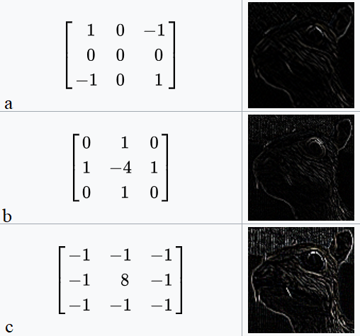

Table of Contents:

## 1. Introduction:

## 2. Convolution:
- Ever heard of Convolutional Neural Networks?
- 1D Conv
- 2D and 3D Conv
- Conv in images
- Deconvolution
- Optional read [Fourier Transform]

## 3. Filtering:
- Point operators
- Filtering (`imfilter` and `imgaussfilt`) (MEAN, MEDIAN filters)
- Sobel, Prewitt filtering
- Padding in images (`paddarray`)
- Erosion and Dilation (`imerode` and `imdilate`)
- Denoising

## 4. Features Detection:
- What are features?
- Derivates in images
- Edge: Canny `approxcanny` , Sobel, Prewitt, Roberts.
- Corner: Harris, Shi Tomasi, FAST
- Blob detection: LoG, DoG
- Feature Descriptor: SIFT (Scale selectivity (CIS 580) Multi-scale concepts), SURF and HOG

## 5. Camera Model
- Pinhole model
- Distortion
- Intrinsic Calibration $$K$$ Matrix
- Extrinsic calibration (couple of lines)

## 6. Transformation:
- Homogenous Coordinates
- Projective Geometry
- Projective Transformation
- Affine Tranformation
- Vanishing Points
- Homography
- Deep learning, CNN and Deep Homography
- Single View Geometry

## 7. Panorama Stitching:
- ANMS
- Feature Correspondence
- Homography
- Make it robust using RANSAC
- Cylindrical Projection
- Blending images (Laplacian Pyramid)
- 

## -----------------------------------------------------

## 1. Introduction:

## 2. - Features and Convolution:
- What are features?
- Ever heard of Convolutional Neural Networks?
- 1D Conv
- 2D and 3D Conv
- Conv in images
- Kernels
- Deconvolution
- Optional read [Fourier Transform]

## 3. Filtering:
- Point operators
- Filtering (`imfilter` and `imgaussfilt`) (MEAN, MEDIAN filters)
- Sobel, Prewitt filtering (- Derivates in images)
- Padding in images (`paddarray`)
- Erosion and Dilation (`imerode` and `imdilate`)
- Denoising

## 4. Types of Features:

- Edge: Sobel, Prewitt, Roberts, Canny and `approxcanny`
- Corner: Harris, Shi Tomasi, FAST
- Blob detection: LoG, DoG
- Descriptor: SIFT (Scale selectivity (CIS 580) Multi-scale concepts), SURF and HOG

## Features and Convolution:
### 2.1 What are features?
What are <i>features</i> for Machine vision? <i> Is it similar as Human visual perception? This question can have different answers but one thing is certain that feature detection is an imperative building block for a variety of computer vision applications. We all have seen <i> Panorama Stitching </i> in our smartphones or other softwares like Adobe Photoshop or AutoPano Pro. The fundamental idea in such softwares is to align two or more images before seamlessly stitching into a panorama image. Now back to the question, <i> what kind of features should be detected before the alignment? </i> Can you think of a few types of features?

A set of particular position in the images like building corners or mountain peaks can be considered as features. These kinds of localized features are known as <i>corners</i> or keypoints or interest points and are widely used in different applications. These are characterized by the appearance of neigborhood pixels surrounding the point (or local patches). The other kind of feature is based on the orientation and local appearance and is generally of a good indicator of object boundaries and occlusion events. <i> Occlusion means that there is something in the field of view of the camera but due to some sensor/optical property or some other scenario, you can't.</i> 

There are multiple ways to detect certain features. One of them is convolution. <i> What is convolution? It is really 'convoluted'? </i> Before we really understand what convolution really means, think it as an operation of changing the pixel values to a new set of values based on the values of the nearby pixels. <i> Didn't get the gist of it? Don't worry! </i>

Convolution is an operation between two functions, resulting in the another function that depicts how the shape of first function is modified by the second function. The convolution of two functions, say $$f$$ and $$g$$ is written is $$f\star g$$ or $$f*g$$ and is defined as:
$$
(f*g)(t) = \int_{-\infty}^{\infty} f(\tau)g(t-\tau)d\tau = \int_{-\infty}^{\infty} f(t-\tau)g(\tau)d\tau
$$

Let's try to visualize convolution in one dimension. The following image depcits the convolution <i>(in black)</i> of the two functions <i>(red and green).</i> One can think convolution as the common area under the functions  $$f$$ and $$g$$.

  
  
A cartoon drawing of a biological neuron (left) and its mathematical model (right).

Since we would be dealing with discrete functions in this course, let us look at a simple discrete 1D example:
$$f = [10, 50, 60, 10, 20, 40, 30]$$ and 
$$g = [1/3, 1/3, 1/3]$$
Let the output be denoted by $$h$$. What would be the value of $$h(3)$$? In order to compute this, we slide $$g$$ so that it is centered around $$f(3)$$ _i.e._
$$\begin{bmatrix}10 & 50 & 60 & 10 & 20 & 40 & 30\\0 & 1/3 & 1/3 & 1/3 & 0 & 0 & 0\end{bmatrix}$$
We multiply the corresponding values of $$f$$ and $$g$$ and then add up the products _i.e._
$$h(3)=\dfrac{1}{3}50+\dfrac{1}{3}60\dfrac{1}{3}10=40$$
Again, it can be infered that the function $$g$$ (also known as kernel operator or the filter) is computing a windowed average of the image.

Similarly, one can compute 2D convolutions (and hence any $$N$$ dimensions convolution) as shown in image below:

  
  
A cartoon drawing of a biological neuron (left) and its mathematical model (right).

These convolutions are the most commonly used operations for smoothing and sharpening tasks. Look at the example down below:

  
  
A cartoon drawing of a biological neuron (left) and its mathematical model (right).

Different kernels (or convolution masks) can be used to perform different level of sharpness:

  
  
(a). Convolution with an identity masks results the same image as the input image. (b). Sharpening the image. (c). Normalization (or box blur). (d). 3X3 Gaussian blur. (e). 5X5 Gaussian blur. (f). 5X5 unsharp mask, it is based on the gaussian blur. NOTE: The denominator outside all the matrices are used to normalize the operation.

Apart from the smoothness operations, convolutions can be used to detect features such as edges as well. Figure **[Number]** shows ....

  
  
Detecting edges in an image with different kernels.

[Deconv]
[Fourier Optional Read]
[Kernels (known as point operators): Sobel (derivatives in images) and Prewitt]
[Filtering] imfilt and imgauss
[Padding]
[Erode and dilate]
[Denoise]
[Back to features...we already studied about sobel and prewitt edge detectors]
[Adaptive edge detectors: Canny and approxCanny]
[Corners]
[Blob: LoG and Dog]
[Feature Descriptor: SIFT (Scale selectivity (CIS 580) Multi-scale concepts), SURF and HOG]

[Camera Model]
- Pinhole model
- Intrinsic Calibration $$K$$ Matrix
- Distortion and lens correction
- Extrinsic calibration (couple of lines)

[Transformation]
- Homogenous Coordinates
- Projective Geometry
- Projective Transformation
- Affine Tranformation
- Vanishing Points
- Homography
- Deep learning, CNN and Deep Homography
- Single View Geometry

[Panorama Stitching:]
- ANMS
- Feature Correspondence
- Homography
- Make it robust using RANSAC
- Cylindrical Projection
- Blending images (Laplacian Pyramid)

## Transformations:
- At an elementary level, geometry is the study of points and lines and their relationships. 
- A point in the plane can be represented as a pair of coordinates $$(x,y)$$ in $$\mathbb{R}^2$$ (Remember Math module: Hilbert space). 
- Points and lines: A line in any plane can be represented as: $$ax+by+c=0$$ where $$a,b,c\in\mathbb{R}$$. This line can also be represented as a vector $$(a,b,c)^T$$. It is important to note that the vector can be of any scale $$\lambda$$ _i.e._ the line can be written as a vector $$\lambda(a,b,c)^T$$ $$\ \ \forall \lambda\in\mathbb{R}-\{0\}$$. A set of such vectors with different values of $$k$$ forms an equivalence class of vectors and are known as homogenous vectors or homogenous coordinates.
- 3D point projection (Metric Space): The real world point $$(X,Y,Z)$$ is projected on the image plane as 

  
  
  
A cartoon drawing of a biological neuron (left) and its mathematical model (right).

## Additional References

- [deeplearning.net tutorial](http://www.deeplearning.net/tutorial/mlp.html) with Theano
- [ConvNetJS](http://cs.stanford.edu/people/karpathy/convnetjs/) demos for intuitions
- [Michael Nielsen's](http://neuralnetworksanddeeplearning.com/chap1.html) tutorials
